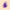
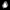
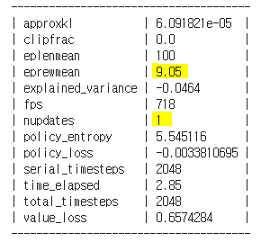
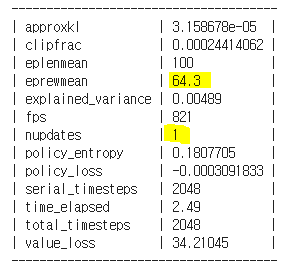
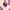
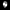
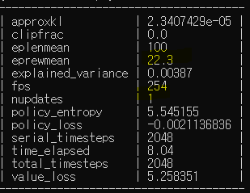
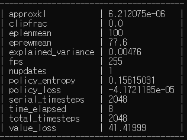
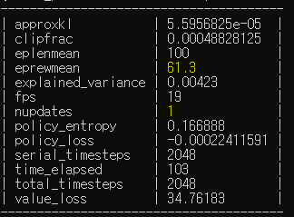

# About

I tried to solve real world problems with machine learning in this research project. I noted that there is a limit to the traditional Deep Learning application, which is highly dependent on existing datasets because it is very difficult to obtain labled data in the biomedical sector.

For applying to biomedical field, the basis for judgment must be clear, so I decided to use image among various types of data for the reason of being visualized intuitively using mask.

After training only one labeled image data, I wanted to categorize a lot of unseen data based on it, and to solve the basic concept of one-shot learning through reinforcement learning.

In this project, I redefined the one-shot image segmentation problem as a reinforcement learning and solved it using PPO. I found that there was actually a dramatic performance.


# Reinforcement learning

I defined the human's ability to read images as a policy of reinforcement learning, and an agent's prediction of this as an action. I also considered inverse reinforcement learning and GAIL. In this case, the reward function is pretty clear and the policy can be important. I chose PPO that also does not need the MDP(Markov Descion Proecess).

I used PPO of OpenAI gym, and implemented custom env for this project. I felt a similarity with GO in that an agent creates a grayscale mask from the original RGB image, so named it as "OneShotGo".

## Reward Function
The agent reads the original image and converts it into a two-dimensional array as large as the image size, and performs a back-white calibration by comparing the pixel value with the predicted value. I designed the reward function with the correct rate compared to the actual labled mask. 

In other words, the agent produces a mask every time through repeated actions, which will receive a higher reward if they are similar to the correct answer.
```
reward = ( min(count[0], self.mask_zero_count) / max(count[0], self.mask_zero_count)) ** 2
```
The key to this return function is using the min max function so that the number of zeros is the most important and the correctness, whether large or small, is equally affected. Given the nature of biomedical images, background and object classification are most important, and slide images are mostly colored, so the better the background is blown away, the higher the reward.

I also considered using MSE and SSIM, but the former was not appropriate due to high variance and the latter was always highly similarity.

## Action
The intention was to distinguish the background from the cell boundary and the nucleus at the same time with the black, grey and white. To do this, two separate uint8 between 0 and 255 are required for action_space. There is still a problem where Tuple action_space is not implemented yet in PPO of OpenAI, and in the case of Box, a bug with an action value of between -1.0 and 1.0 was found as float, regardless of defined the action space. I eventually used only one discrete integer.

## action_space, observation_space
Discrete or -1.0 to 1.0 Box action_space, are already widely used in games such as Arati and seem to be well implemented. It works well  with observation_space, not action_space. Until the fix, it would be better to be careful if you apply PPO of gym in a unique way.

## keras-rl, tensorforce, ray, SLM
keras-rl has not yet implemented a PPO. In case of tensorforce, it was unstable because it did not fit my development environment. Ray does not yet support for Windows. In the case of SLM, the dependency of the ray makes it not support for Windows. I installed and tested Linux in Windows using WSL, but due to the instability of WSL, the system was failed while apt-get update. OpenAI was my best choice.

# Enviroment
## Install
```
git clone https://github.com/decoderkurt/research_project_school_of_ai_2019.git
cd research_project_school_of_ai_2019/oneshotgo
pip install -e .
cd ..
```
## Train
```
python -m baselines.run --alg=ppo2 --env=OneShotGo-v0 --save_path="YourOwnOneShotGo10M"
```
## Test
```
python -m baselines.run --alg=ppo2 --env=OneShotGo-v0 --load_path="OneShotGo10M"
```
# Result
## Train 10x10 image (012.bmp)




## Test 10x10 unseed image (065.bmp)





## Test 100x100 unseed image (065.bmp)



