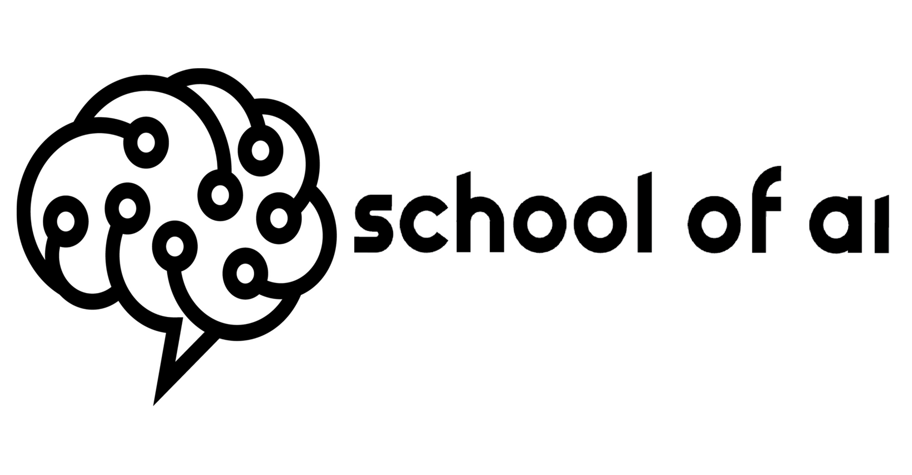
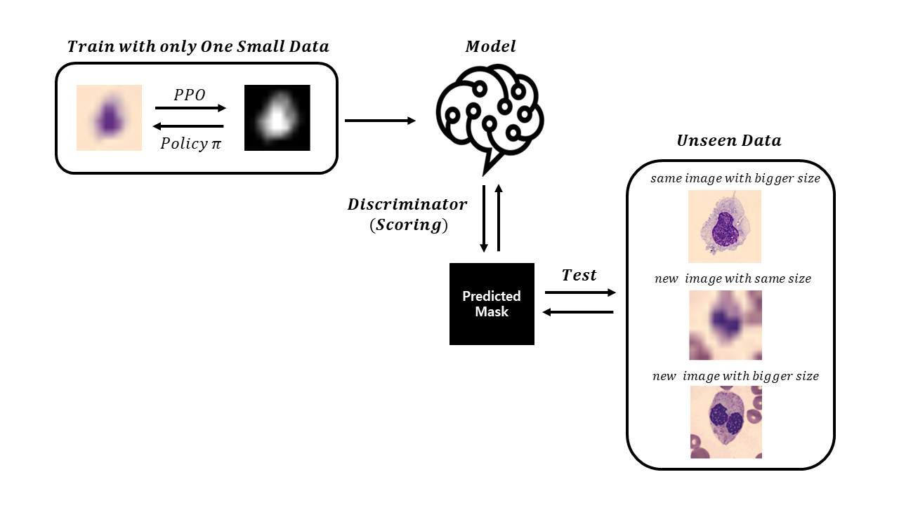
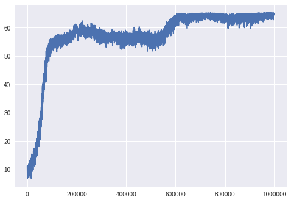
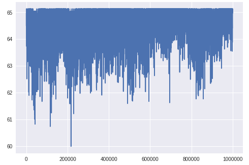
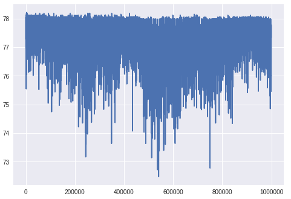
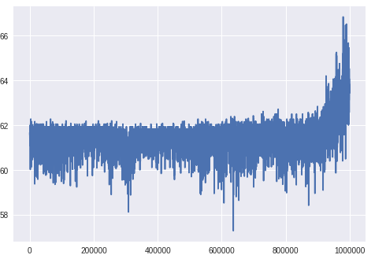

[](https://www.theschool.ai/school-of-ai-fellowship/)

# One shot learning using Proximal Policy Optimization 
**Kurt Koo** callmekoo@gmail.com [](https://www.linkedin.com/in/kurtkoo)   [](https://twitter.com/kurt_koo)  [](https://www.facebook.com/vcmlrl) <br> *Research Fellow, School of AI*  


## Introduction
In this research project, to solve real world problems with machine learning, I noted that there is a limit to the traditional Deep Learning application, which is highly dependent on existing datasets because it is still difficult to obtain enough labled data.

The basis for judgment must be clear in the biomedical field, so I decided to use image data among various types for the reason of being visualized intuitively.

Using just one labeled image data for training, I wanted to categorize a lot of unseen data based on it by the basic concept of one shot learning through reinforcement learning.

In this project, I redefined the one shot image segmentation problem as a reinforcement learning and solved it using PPO. I found that there was actually a dramatic performance.

<p align="center">

</p>

## Reinforcement learning
I defined the human's ability to read images as a policy of reinforcement learning, and an agent's prediction of this as an action. I also considered inverse reinforcement learning and GAIL. But, in this case, the reward function is pretty clear and the policy is more important, I descided to use PPO that also does not need the MDP(Markov Decision Process).

I used PPO of OpenAI gym, and implemented custom env for this project. I felt a similarity with GO in that an agent creates a grayscale mask from the original RGB image, so named it as "OneShotGo".

### *Reward Function*
An agent reads the original image and converts it into a two-dimensional array at the size of the image, and performs a black-white calibration by comparing the pixel value with the predicted value. I designed the reward function with the correct response rate compared to the actual labled mask. 

In other words, the agent produces a mask every time through repeated actions, which will receive a higher reward if they are similar to the correct answer. A trained model discriminates the agent with this reward as a score.
```
reward = ( min(count[0], self.mask_zero_count) / max(count[0], self.mask_zero_count)) ** 2
```
The key to this reward function is using the min max function to keep the prediction is equally affected. Given the nature of biomedical images, background and object classification is very important. The slide images are usually colored, so the better the background is blown away, the higher the reward.

I also considered using MSE(mean square error) and SSIM(structural similarity), but the former was not appropriate due to high variance and the latter too high similarity.

<p align="center">

</p>

### *Action*
My intention was to distinguish the background from the cell boundary and the nucleus at once with the black, grey and white colors. To do this, two Discrete uint8 between 0 and 255 are required for the action_space. There is still a problem where Tuple action_space is not implemented yet, and in the case of Box, a bug with an action value was found. A float value between -1.0 and 1.0 appeared which is out of the defined action_space bound. I eventually used only one discrete integer for black and white color, abandoned on the grey.

### *action_space, observation_space*
Discrete or -1.0 to 1.0 Box action_space, are already widely used in games such as Arati and seem to work well. It has no problems with observation_space, not action_space. Until fixed, it would be better to be careful if you apply PPO of gym in a your own way.

### keras-rl, tensorforce, Ray, SLM
keras-rl has not yet implemented PPO. In case of tensorforce, it was unstable because it did not fit my development environment. Ray does not yet support for Windows. In the case of SLM, the dependency of the Ray makes it not support for Windows. I installed and tested Linux in Windows using WSL, but due to the instability of WSL, the system was failed while apt-get update. OpenAI was my best choice.

## Experiment
### Requirements
```
pip install gym
pip install tensorflow
pip install opencv-python
pip install joblib
pip install pillow
```

If you are using ubuntu, you will need to run theses (you don't need to run theses on Windows)
```
sudo apt-get install libsm6
sudo apt-get install libxrender1
```
### Install
```
git clone https://github.com/decoderkurt/research_project_school_of_ai_2019.git
cd research_project_school_of_ai_2019
pip install -e .
```
### Train
```
python -m baselines.run --alg=ppo2 --env=OneShotGo-v0 --save_path="YourOwnOneShotGo10M"
```
### Test
```
python -m baselines.run --alg=ppo2 --env=OneShotGo-v0 --load_path="OneShotGo10M"
```
## Result
### Train
#### 10x10 image (012.bmp)


|Before|After|
|---|---|
|||

### Test
#### 10x10 unseen image (065.bmp)


|Before|After|
|---|---|
|||

#### 100x100 unseen image (065.bmp)


|Before|After|
|---|---|
|||

## Conclusion
||Training|Test1|Test2|Test3|
|---|---|---|---|---|
|File|012.bmp|012.bmp|065.bmp|065.bmp|
|Data Size|10x10|10x10|10x10|100x100|
|Timesteps|1e6|1e6|1e6|1e6|
|Result|||||

|Test|Filename|Size(pixel)|Before|After|Effect|
|---|---|---|---|---|---|
|Test1|012.bmp|10x10|9.05|64.3|710%↑|
|Test2|065.bmp|10x10|22.3|77.6|347%↑|
|Test3|065.bmp|100x100|17.9|61.3|342%↑|

Using only one image training with PPO, I got about three times more effective improvement than if it did not apply. Through this research project, I saw the possibility of solving real world problems using reinforcement learning where traditional deep learning could not be applied due to lack of dataset.

Also, I can see PPO worked well even in different size unseen images. I think the strength of reinforcement learning is that it can be applied to more complex and time-consuming data after learning it quickly with a small sized.

## Future work 
I have tested 10x10 size learned model, but it would be good to try with a higher size single image such as 300x300. Also, multi-target recognition can be a good topic. It will be interesting to create higher quality masks using a tuple action_space in the future. 
Further, I want to research links with GAN(Generative Adversarial Network) in that it evaluates generated by the prediction using min max function as scoring to make higer quality masks.

## Colab link
[](https://colab.research.google.com/github/decoderkurt/research_project_school_of_ai_2019/blob/master/Research_Project_SchoolofAI.ipynb) 
https://colab.research.google.com/github/decoderkurt/research_project_school_of_ai_2019/blob/master/Research_Project_SchoolofAI.ipynb

## Acknowledgements
I gratefully acknowledge the support from the School of AI and its Director, Siraj Raval, as well as Jess Stahl, DBH for her help and contributions.

## Reference
[1]OpenAI https://github.com/openai/baselines https://github.com/openai/gym <br>
[2]Proximal Policy Optimization Algorithms https://arxiv.org/abs/1707.06347 <br>
[3]Dataset https://github.com/zxaoyou/segmentation_WBC
